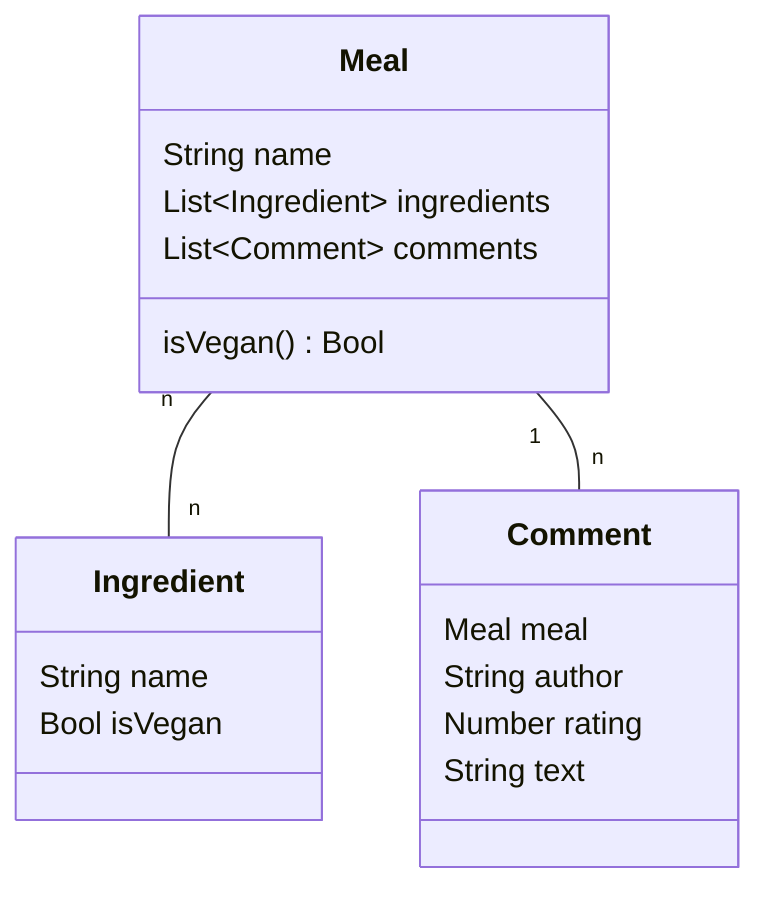

# Was vorhanden ist

- Informationsportal zum Angebot von Tagesgerichten
  - Angebote werden von Tageskarten automatisiert übertragen
    - > wahrscheinlich nur Gericht-Namen (oder Zutaten?)
  - Angebote sind auf der Informationsportal einsehbar

# Was gefordert ist

- **neues** Softwaresystem als OOA 
- Klassifizierung der Gerichte als "vegan"
- Inhaltliche Erweiterung der Tagesgerichte
- Erfassung "authentischer" Bewertungen (nur der veganen Gerichte)
  - Key: Bewertungsprozess
  - > Q: Was bedeutet authentisch?
    > A: Bewertung von echten Menschen + Glaubwürdigkeit auf Basis verschiedener Bewertungen
- Bereitstellung der klassifizierten Daten mit Bewertung für das Legacy-System (View / Informationsportal)

# Was wir benötigen

> Q: Ist es quasi eine Art "Rucksack" um das aktuelle System um eine Klassifizierung und Bewertungen zu erweitern?
- Schnittstelle zum Legacy-System, welches die Tagesgerichte bereitstellt/anzeigt
  - Legacy-System als Datenbank/Datenlieferant
  - neue Daten selbst bereitstellen für das Legacy-System (Soll eine Erweiterung sein)
- OOA
  - Auffassen der Gerichte als Objekt
    - Attribute: Name: string, Ingredients: Object[], isVegan: boolean/Function, Comments: Object[]
  - Auffassen der Ingredients als Objekt
    - Attribute: Name: string, isVegan: boolean
  - Auffassen der Comments als Objekt
    - Attribute: Author?: string/Objekt[], Text: string, Rating: number
    - Sicherstellen der Authentizität:
      - Nur Kommentare von Benutzern die zu verschiedenen Gerichten Kommentieren
      - Andere Kontrollmechanismen wie z.B. Validierung durch Moderatoren/Menschen
- Evtl.: Erweitern der Gerichte auf Basis des Namens um die Ingredients
- Evtl.: User-Verwaltung / Authentication System für Benutzer
  - damit wir die bewerten können ob Bewertungen authentisch sind
  - Absicherung der User-Erstellung durch multi-factor-authentication

# Klassendiagramm für die Daten (einfacher Teil)

